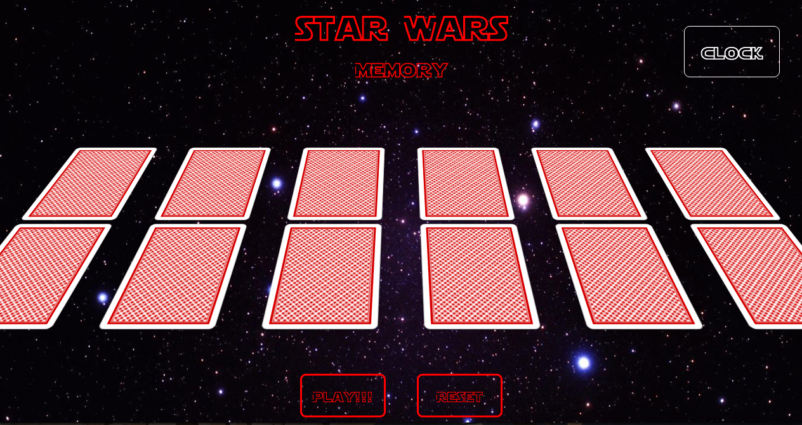
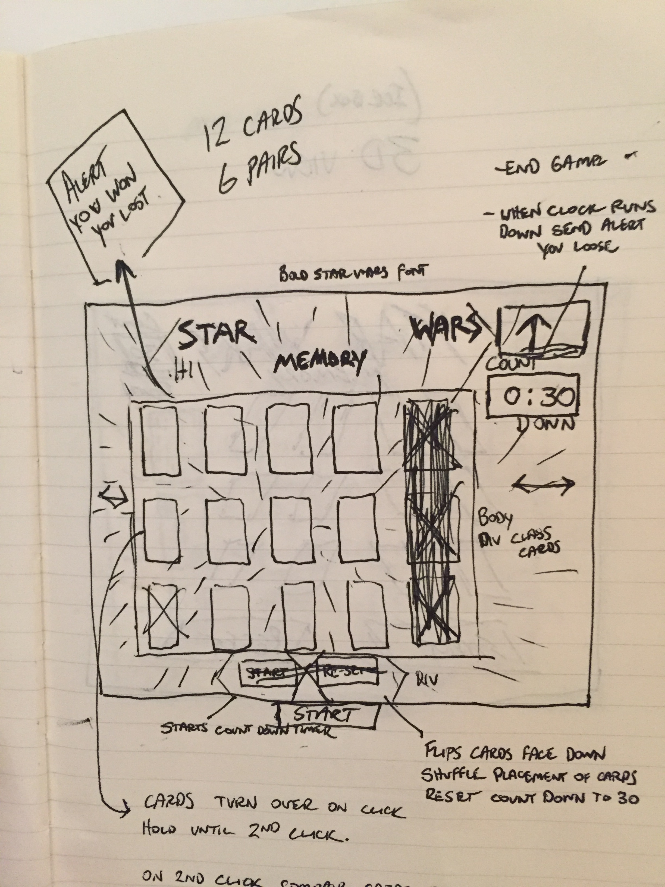
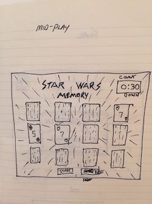
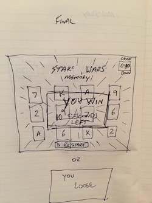

## Star Wars Memory

### Credits:   
Many people helped this project come to fruition. The following people played an important role and were of great help. 

"It is amazing what you can accomplish if you do not care who gets the credit."
-Hary Truman 
    
>[Ezra Raez](https://github.com/EARnagram)        
>[Jim Clark](https://github.com/jim-clark)     
>[Phil Hughes](https://github.com/h4w5)   
>[Adrian Delpha](https://github.com/Ishmaru)   
>[Stephanie Wilkinson](https://github.com/stephaniewilkinson)   

"It is amazing what you can accomplish if you do not care who gets the credit."   
-Hary Truman

## Intro

Get ready to enter into epic battle of memory. Your mind is a terrible thing to waist, some
people say it is the first thing to go, so let's see how much of yours is left. 

Star Wars Memory is a fun game of memory where you have a dozen cards face down.  
The challenge is that you have to find matching cards by picking two at a time in under 30 seconds.   

  

  

##Star Wars Memory
[Click to Play](http://kylefberg.github.io/star_wars_memory/)
  
##Trello Board 
[Trello Link](https://trello.com/b/BDu2GqX6/memory-card-game)

###How to Play

>1) To start, click the start button at the bottom of the page. This will start the game and the timer so, no time to waste.   

>2) After you recover from Hyper-speed sickness, pick a card. You will see an image on the first card, now pick a second card and try to find the match.    

>3) Both cards will be displayed for a flash so pay attention. If the cards match they will stay on the screen, if they are not the cards will flip back to face down.   

>4) In order to win, you must match all the cards in the deck in under 30 seconds and you Win! No problem right?  
>
But if the clock runs out you lose!

>5) If you would like to play again, just hit the reset button, and when you have built up your courage, hit start and go for it!

**May the Force be with you!**

###TECHNOLOGIES

The game is designed in HTML, CSS where the page layout and styling take 
place. JavaScript is the heart of the game where all the functions live.
I also used some jQuery to simplify some of the JavaScript code. I pushed
the entire game to GitHub so that my progress could be tracked and each 
step would be saved. I then pushed to GH Pages so the rest of the world could
enjoy the game.  

###DESIGN

My design started with my common knowledge of the game memory. I started by 
doing several wire frames to get an idea of what I wanted my final project to
look like.    

  
   
  

I then wrote over a dozen user stories mapping out the process I planned on using along with breaking each step into bite size pieces. [Trello Link](https://trello.com/b/BDu2GqX6/memory-card-game) I organized 
each action item into categories like HTML, CSS and JavaScript. This helped me 
organize each step and also served as a reminder to push to GitHub often.

###GET STARTED

When you are ready to get started, simply [Click to Play](http://kylefberg.github.io/star_wars_memory/)

###NEXT STEPS

In my icebox I have several ideas to improve the existing game. Some of those 
ideas include animations to have the cards more 3D on the flip feature. I also am working on different levels of difficulty where the clock gives you more or less time depending on what level you pick. 

